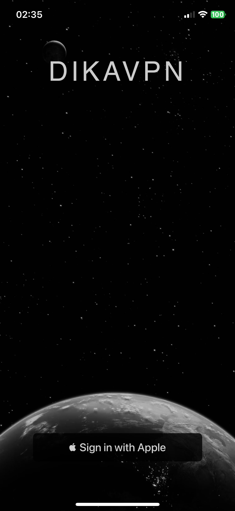

# DikaVPN

DikaVPN is a high-speed and secure VPN application for iOS and iPadOS, built on the Outline technology. Ensuring fast and stable performance, DikaVPN allows you to protect your internet connection and bypass geographical restrictions with ease.

## Key Features
- 🚀 **High Speed:** Utilizes Outline technology to provide maximum speed and performance.
- 🔒 **Security:** Reliable data encryption to protect your privacy.
- 🖱️ **Ease of Use:** Intuitive interface for quick VPN connections.
- 🌐 **Automatic Connection:** Automatically connects to the optimal server for the best performance.
- 📱 **Compatibility:** Supports iOS and iPadOS, optimized for all modern Apple devices.

## Screenshots

### VPN Registration

  

### VPN Connection

  
  

## Installation and Setup
- 📥 **Download:** Obtain the DikaVPN app directly from the developer as a pet project.
- 🛠️ **Registration:** Sign in using your Apple ID with the "Sign in with Apple" button.
- 🔄 **Connection:** The app automatically connects to the optimal server.

## Benefits of DikaVPN
- ⚡ **Quick Setup:** Simple registration via Apple ID and automatic connection in seconds.
- 🛡️ **High Level of Protection:** Reliable data encryption ensures the security of your internet connection.
- 🌍 **Internet Freedom:** Bypass geographical restrictions and censorship, accessing any content on the internet.

## Support and Feedback
If you have any questions or issues using DikaVPN, please contact us through our Telegram: [@Said](https://t.me/sdtpv).

## License
DikaVPN is distributed under the [MIT License](https://opensource.org/licenses/MIT).

## Community and Contributions
We welcome contributions from the community. If you want to contribute to the development of DikaVPN, please review our contribution guidelines and code of conduct.
